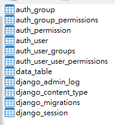

# django-memo

- 一開始是由itheme上學習，不過因為過於破碎，吸收的不是太好，且有些指令有遺漏，常常做到一半就做不下去....
- 2020年買入唐元亮老師的[【Django3-從平凡到超凡】](https://www.books.com.tw/products/0010854217?loc=M_0009_006)這本書，感覺有系統多了! 雖然裡面教的並不是我想要的前後端分離，但依然建立了不錯的實作練習 (每個人喜愛的書寫風格不同，但至少我是收穫良多)

## django project指令memo

- 我是在資料夾`D:\python\django\water_prj`中開始我的專案的
- virtualenv環境建立: (p3-2)
  - `D:\python\django\water_prj>virtualenv venv`
  - `venv\Scripts\activate.bat` 啟用 venv環境

- 安裝django環境 (p3-3)
  - `pip install django`
  - 確認目前安裝的套件:
  ```
  (venv) D:\python\django\water_prj>pip freeze
  asgiref==3.3.1
  Django==3.1.7
  pytz==2021.1
  sqlparse==0.4.1  
  ```
  
- 建立新專案 (p3-6)
  - `django-admin startproject water`
  - 用 tree 指令看一下目前django為我們產生的專案基本架構 `tree D:\python\django\water_prj\water /F /A`
  ```
  D:\PYTHON\DJANGO\WATER_PRJ\WATER
  |   manage.py
  |
  \---water
          asgi.py
          settings.py
          urls.py
          wsgi.py
          __init__.py  
  ```
  - 在專案資料夾`water`中會建立另一個water資料夾，是專案直屬的App (djangoe是這樣稱呼的)，我們可以在一個專案中建立多個App，每一個有不同的功能，達成模組化管理
  - manage.py則是Django的專案管理程式
  - `water` App中的檔案說明如下:
    - __init__.py : 設定此目錄為Python package
    - asgi.py : 非同步伺服器閘道介面 (Asynchronous web server gateway interface)，django好像都用這個
    - settings.py : 專案設定擋 (資料庫的資訊設定在這邊)
    - urls.py : 專案的 URL request 設定擋
    - wsgi.py : 伺服器閘道介面 (web server gateway interface)，
  - 編輯設定擋
    - 改host, db setting, lang., time_zone
    - 其中，'NAME'指的是資料庫的名稱
    ```
    ...

    ALLOWED_HOSTS = ['*']
    #ALLOWED_HOSTS = []

    ...

    DATABASES = {
        'default':{
            'ENGINE': 'django.db.backends.mysql',
            'NAME': 'water',
            'USER': 'user',
            'PASSWORD': 'ixdezuser',
            'HOST': 'dosg.maria.ewxew.com',
            'PORT': '43306',
        }
    }
    ''' # default DB setting
    DATABASES = {
        'default': {
            'ENGINE': 'django.db.backends.sqlite3',
            'NAME': BASE_DIR / 'db.sqlite3',
        }
    }
    '''

    ...

    LANGUAGE_CODE = 'zh-hant'
    #LANGUAGE_CODE = 'en-us'

    TIME_ZONE = 'Asia/Taipei'
    #TIME_ZONE = 'UTC'

    ```
    
  - 當然這時候就需要安裝mariaDB (or mySQL)的python套件，我之前使用pymysql，但網路上有人建議在django中使用mysqlclient [ref](https://riptutorial.com/django/example/17418/mysql---mariadb)
    - 我先安裝pymysql: `pip install pymysql`
    - but 後面做資料庫遷移時就出錯了....，有提示訊息:
    ```
    django.core.exceptions.ImproperlyConfigured: Error loading MySQLdb module.
    Did you install mysqlclient?
    ```
    - 改安裝mysqlclient: `pip install mysqlclient`

- 資料庫遷移: 在django中本身有自己預設的很多資料表(對應到資料模型)，因此前置作業弄好後，接著就是要來做`資料庫的遷移`(django都是這樣稱呼這個動作的)
- 下指令
  - `python manage.py makemigrations` 產生需要的SQL程式
  - `python manage.py migrate` 利用makemigrations產生的SQL程式來產生資料表
  - 過程如下:
  ```
  (venv) D:\python\django\water_prj\water>python manage.py makemigrations
  No changes detected

  (venv) D:\python\django\water_prj\water>python manage.py migrate
  System check identified some issues:

  WARNINGS:
  ?: (mysql.W002) MariaDB Strict Mode is not set for database connection 'default'
          HINT: MariaDB's Strict Mode fixes many data integrity problems in MariaDB, such as data truncation upon insertion, by escalating warnings into errors. It is strongly recommended you activate it. See: https://docs.djangoproject.com/en/3.1/ref/databases/#mysql-sql-mode
  Operations to perform:
    Apply all migrations: admin, auth, contenttypes, sessions
  Running migrations:
    Applying contenttypes.0001_initial... OK
    Applying auth.0001_initial... OK
    Applying admin.0001_initial... OK
    Applying admin.0002_logentry_remove_auto_add... OK
    Applying admin.0003_logentry_add_action_flag_choices... OK
    Applying contenttypes.0002_remove_content_type_name... OK
    Applying auth.0002_alter_permission_name_max_length... OK
    Applying auth.0003_alter_user_email_max_length... OK
    Applying auth.0004_alter_user_username_opts... OK
    Applying auth.0005_alter_user_last_login_null... OK
    Applying auth.0006_require_contenttypes_0002... OK
    Applying auth.0007_alter_validators_add_error_messages... OK
    Applying auth.0008_alter_user_username_max_length... OK
    Applying auth.0009_alter_user_last_name_max_length... OK
    Applying auth.0010_alter_group_name_max_length... OK
    Applying auth.0011_update_proxy_permissions... OK
    Applying auth.0012_alter_user_first_name_max_length... OK
    Applying sessions.0001_initial... OK
  ```
  - 資料庫如下圖，除了data_table以外，都是django建立的
  - 
  - 
