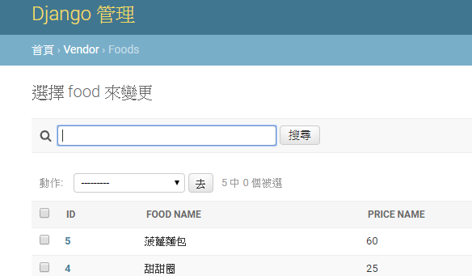
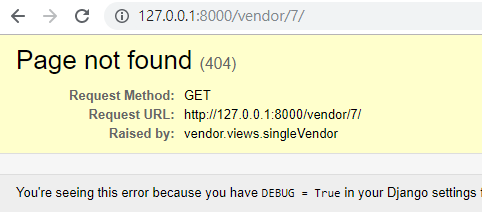

# iTheme: From Django 1.11 to Django 2.1
[link](https://ithelp.ithome.com.tw/articles/10199933)

## Day4 : 打造Apps跟Django say hello!
[link](https://ithelp.ithome.com.tw/articles/10199933)

- app --> Django中一項功能的呈現
- `(venv) D:\python\django\ithome>python manage.py startapp welcome` to new a app
    - it will create a `welcome` folder，其中有六檔一資料夾, include:
    - `__init__.py`: 這資料夾是個package
    - `admin.py`: 設定資料庫呈現的模式，之後會跟models溝通
    - `models.py` : 建構你的資料庫型態
    - `tests.py` : 這是拿來檢查商業邏輯的地方
    - `views.py` : 嗯~就是MTV的view
    - `apps.py`: 用來區隔不同app的檔案
    - `migrations`: 資料夾，記錄著models裡面所創建的資料庫型態
    - `urls.py` : 它擔任著橋樑的角色 --> 要自己另外建的!!

- 修改welcom中的urls.py --> 由itheme資料夾中的urls.py複製來改就好
```
from django.contrib import admin
from django.urls import path

from . import views

urlpatterns = [
    path('', views.index, name='index'),
]
```

- 修改itheme中的urls.py, 
    - include 概念就是，它會將 weclome.urls 下的所有 url 前面都冠上 welcome/的意思
    - 才不會說在 welcome.urls 裡的每一個 url都要加上 welcome/
    ```
    from django.contrib import admin
    from django.urls import path, include

    urlpatterns = [
        path('welcom/', include('welcom.urls')),
        path('admin/', admin.site.urls),
    ]
    ```

### 到這邊 python manage.py runserver , 就可以在`http://127.0.0.1:8000/welcome/`下看到結果了
- 發現加入`path('welcome/', include('welcome.urls')),`這個之後`http://127.0.0.1:8000`連結就失效了!

## Day5 : Django 資料庫的概念
[link](https://ithelp.ithome.com.tw/articles/10200071)

- DATABASES : djanog中設定使用的DB類型
- INSTALLED_APPS: 依你建的app去視察該有的models(when migrate)

## Day6 : 資料庫的創建 - Models
[link](https://ithelp.ithome.com.tw/articles/10200181)

- 修改Models.py 檔案就可以讓django依你的描述建立相對應的DB欄位
- Each model is a Python class that subclasses django.db.models.Model.

## Day7 : 探討 INSTALLED_APPS
[link](https://ithelp.ithome.com.tw/articles/10200276)

- 討論setting.py中的INSTALLED_APPS的寫法
- `vendor.apps.VendorConfig` 替換成 `vendor`這樣也可以, 怪的勒 
- 作者提到Django的說明提到:
```
A list of strings designating all applications that are enabled in this Django installation. Each string should be a dotted Python path to:

an application configuration class (preferred)
a package containing an application
```
- 因此，用application configurationclass較推薦；用package name次之 (有版本演化的 因素)

- 作者推薦去trace我的venv中的`\Lib\site-packages\django\contrib\admi` 套件 --> 看 __init__.py, 找apps.AdminConfig --> 晚點有空再細看吧

## Day8 : 創建管理員 - Admin
[link](https://ithelp.ithome.com.tw/articles/10200494)

- 目前經過之前的操作後，已經有把資料庫建立起來了，想看看? 先建一個有UI的admin吧 (superuser)

- 我create的操作過程:
```
(venv) D:\python\django\ithome>python manage.py createsuper
Unknown command: 'createsuper'. Did you mean createsuperuser?
Type 'manage.py help' for usage.

(venv) D:\python\django\ithome>python manage.py createsuperuser
使用者名稱 (leave blank to use 'malo'): maloxithome
電子信箱: maloyang@gmail.com
Password:            -->打12345678
Password (again):
這個密碼太普通。
這個密碼只包含數字。
Bypass password validation and create user anyway? [y/N]:  -->我按'N'重來
Password:
Password (again):    -->改asdf;lkj
Superuser created successfully.
```

- 在執行`python manage.py runserver`就可以看到管理介面囉
    - 這時要用`http://127.0.0.1:8000/admin`, 而不是提示的少了`/admin`的那一個喔!
    - 這樣就會看到admin的網頁囉，好專業!難怪有人很愛Django這樣就有DB和登入的頁面了!
    - 

- 目前沒看到vendor的資料庫是因為沒有跟admin註冊說要看到他...

- 在 `vendor\admin.py`中，修改如下：
```
from django.contrib import admin
from .models import Vendor, Food

# Register your models here.
admin.site.register(Vendor)
admin.site.register(Food)
```
- 就可以看到
- 

## Day9 : 使用 Shell 創建資料
[link](https://ithelp.ithome.com.tw/articles/10200620)

- 透過 admin 在後台可以管理資料
- 也可以用shell管理資料 (有CRUD --> Create, Retrieve, Update, Delete)
- `python manage.py shell`進入shell操作
- 
- add food:
- 
- 用web來看
- 

## Day10 : Models & Admin (1)
[link](https://ithelp.ithome.com.tw/articles/10200799)

- 取回來的資料名稱是<Vendor: Vendor object (1)>，操作及管理上，實在不太方便
- 回傳的資料變得具有可讀性 --> 去覆寫 __str__ 
```
# Create your models here.
class Vendor(models.Model):
    vendor_name = models.CharField(max_length=20) #vendor name
    store_name = models.CharField(max_length=10) #vendor店名
    phone_number = models.CharField(max_length=20)
    address = models.CharField(max_length=100)

    # 覆寫 __str__
    def __str__(self):
        return self.vendor_name
```

- 這樣就可以在command line操作時，看到名字而不是id
    - 作者提到：因為只是在 Models 覆寫 __str__，而不是修改Models的資料型態，所以不需要進行 makemigrations
- 
- 補充一點：PK怎麼來的? 
    - Django會自動加上
    ```
    id = models.AutoField(primary_key=True)
    ```
- 要如何顯示PK(Primary Key)? 
    - vendor/models.py新增如下：
    ```
    from django.contrib import admin

    ... 中間略 ...

    class VendorAdmin(admin.ModelAdmin):
        list_display = ('id', 'vendor_name') 
    ```
    - vendor/admin.py修改如下：
    ```
    from django.contrib import admin
    # 後方新增 你所建立的 "類別名稱"，這裡我的名稱是VendorAdmin
    from .models import Vendor, Food, VendorAdmbin

    # Register your models here.
    # 將管理者類別 VendorAdmin 填至該類別後方
    admin.site.register(Vendor, VendorAdmbin)
    admin.site.register(Food)
    ```
    - 結果畫面如下：
    - 

## Day11 : Models & Admin (2) 
[link](https://ithelp.ithome.com.tw/articles/10200944)

- 說明Django內建的filter機制

## Day12 : Models & Admin (3)
20191018, [link](https://ithelp.ithome.com.tw/articles/10201074)

- 介紹修改admin的幾個方法: fields, search_fields, ordering
-  fields: 功用是限制 Admin 可以修改的欄位, 避免不必要的修改發生
- 加入`fields = ['price_name']`後修改會變成只有一個欄位
- 
    - 也可改成`exclude=['food_name', 'food_vendor'`
- search_fields: search 功能
    - search_fields = ('food_name','price_name') # 搜尋欄位
    - 改完就會出現搜尋欄

- ordering: 排序，找最大或最小時好用!
    - 加入`ordering = ('price_name',) # 價格 由小到大 排序`
    - 不過這個範例比較沒有這麼好，因為Django的表格早就已經有排序功能了


## Day13 : path & re_path vs. url
20191019, [link](https://ithelp.ithome.com.tw/articles/10201230)

- Django2.X 及 Django1.11 在url path的寫法呈現上差異比較大
- 這個主題分3個項目：path, re_path, url
- Django2以前都是用 url()+RE處理網址的配對的；但Django2改用path, re_path，url()建議不用，因為未來的不久會拿掉
    - 寫法比較, 新的比較像flask的寫法:
    ```
    #原本的寫法
    url(r'^articles/(?P<year>[0-9]{4})/$', views.year_archive),
    url(r'^articles/(?P<year>[0-9]{4})/(?P<month>[0-9]{2})/$', views.month_archive),

    #修改後的寫法
    path('articles/<int:year>/', views.year_archiv),
    path('articles/<int:year>/<int:month>', views.montu_archiv)    
    ```

## Day14 : Template 的運作
20191019, [link](https://ithelp.ithome.com.tw/articles/10201397)

- 在 ithime中的settings.py裡面的`TEMPLATES`部分:
    - 這是Django預設在找template的設定
    - DIRS是請Django額外找template的目錄
    - 這邊作者建議放在和apps-vendor同一層
    - 
    - 寫死: 不是個好方法`'DIRS': ["[yourpath]/templates"` ，未來專案換位置程式就不會動了
    - Django有提供一個`BASE_DIR`可以取得目前project的位置 --> 在`settings.p` 中可以找到她的定義 `BASE_DIR = os.path.dirname(os.path.dirname(os.path.abspath(__file__)))`。
    - Django還很貼心的告訴你可以用`os.path.join(BASE_DIR, ...)`來使用他。

- templates render的[寫法說明](https://docs.djangoproject.com/en/2.1/ref/templates/builtins/)

- 改`vendor/urls.py`
    ```
    # 修改前
    urlpatterns = [
        path('', views.showtemplate),
    ]

    # 修改後
    urlpatterns = [
        # 後方的 name 可以先忽略，目前不會用到
        path('', views.showtemplate, name="vendor_index"),
    ]    
    ```
- 改`vendor/views`
    ```
    from django.shortcuts import render
    from .models import Vendor
    # Create your views here.
    def showtemplate(request):
        vendor_list = Vendor.objects.all() # 把所有 Vendor 的資料取出來
        context = {'vendor_list': vendor_list} # 建立 Dict對應到Vendor的資料，
        return render(request, 'test.html', context)    
    ```

- 改`templates/test.html`
    ```
    <!DOCTYPE html>
    <html lang="en" dir="ltr">
    <head>
        <meta charset="utf-8">
        <title></title>
    </head>
    <body>
        
        <h1> 店家 : {{vlist.vendor_name }} </h1>
        <ul>
        <li>店名 : {{ vlist.store_name }}</li>
        <li>電話 : {{ vlist.phone_number }}</li>
        <li>地址 : {{ vlist.address }}</li>
        </ul>
        
    </body>
    </html>
    ```
- 連向`http://127.0.0.1:8000/vendor/`即可看到結果

## Day16 : Template 範本
20191021, [link](https://ithelp.ithome.com.tw/articles/10202006)

- 加入`templates\base.html`
    ```
    <!DOCTYPE html>
    <html lang="en" dir="ltr">
    <head>
        <meta charset="utf-8">
        <title> </title>
    </head>
    <body>
        
        
    </body>
    </html>    
    ```

- 改`templates\test.html`
    ```
    
     My store 
    
    
    <h1> 店家 : {{vlist.vendor_name}} </h1>
    <ul>
        <li>店名 : {{ vlist.store_name}}</li>
        <li>電話 : {{ vlist.phone_number}}</li>
        <li>地址 : {{ vlist.address}}</li>
    </ul>
    
    
    ```

## Day17 : Django 插拔性
20191021, [link](https://ithelp.ithome.com.tw/articles/10202425)

- 不同 app 的 templates新增一個專屬於該 app 的資料夾，較直觀
- 新增一個`templates/vendor/detail.html`
    ```
    <!DOCTYPE html>
    <html lang="en" dir="ltr">
    <head>
        <meta charset="utf-8">
        <title></title>
    </head>
    <body>
        <h1> show detail </h1>
    </body>
    </html>    
    ```

- `vendor/views.py` 加入
```
def showdetail(request):
    return render(request, 'vendor\detail.html')
```

- `vendor/urls.py`修改
```
urlpatterns = [
    # 後方的 name 可以先忽略，目前不會用到
    #path('', views.vendor_index, name="vendor_index"),
    path('', views.showtemplate, name="vendor_index"),
    path('detail', views.showdetail),
]
```

- 另外，Django也可以讓你改成在app資料夾中中建立templates資料夾 --> Django也會找這一個資料夾，但它有一個規則! 你要建立成 vendor/templates/vendor/detial.html才行
    - 所以我們移過來到這邊後，vendor/urls.py, vendor/views.py都不會再動!


## Day18 : Django ModelForm
20191021，[link](https://ithelp.ithome.com.tw/articles/10202804)

- 用Django製作一個 Model Form

- 新增 vendor/forms.py
```
from django import forms

from .models import Vendor, Food

class VendorForm(forms.ModelForm):
    class Meta:
        model = Vendor
        fields = '__all__'
```

- 改 vendor/models.py
```
from .forms import VendorForm # 新增: 記得 import 相對應的 Model Form

# 針對 vendor_create.html 
# --> 我的改成vendor，因為我的改在ithome\vendor\templates\vendor\vendor_create.html
def vendor_create_view(request):
    form = VendorForm(request.POST or None)
    if form.is_valid():
        form.save()

    context = {
        'form' : form
    }
    return render(request, "vendor/vendor_create.html", context)
```

- 新增 ithome\vendor\templates\vendor\vendor_create.html
```
# 為了展示給大家看，這裡的code並不完整

 My store 

<h2> Vendor Create</h2>
<form method='POST'>
  {{ form.as_p }}
<input type="submit" value="save" />
</form>

```

- 這裡有個新東西`{{ form.as_p }}`，這是Django提供給Form顯示的一種方式。
    - 有：as_table，as_p，as_ul
    - 代表：form 要透過 HTML 的 <tr> or <p> or <li> 來裝飾


- 改 `vendor\urls.py`，增加：
```
urlpatterns = [
    # 後方的 name 可以先忽略，目前不會用到
    #path('', views.vendor_index, name="vendor_index"),
    path('', views.showtemplate, name="vendor_index"),
    path('detail', views.showdetail),
    path('create', views.vendor_create_view), # 新增
]
```

- 到這邊就可以在 `http://127.0.0.1:8000/vendor/create`看到網頁了


- 要中文! 可以改 vendor/forms.py
```
class VendorForm(forms.ModelForm):
    class Meta:
        model = Vendor
        fields = '__all__'
        # 新增 labels 對應
        labels = {
            'vendor_name': ('攤販名稱'), #-->這邊原文是 _('攤販名稱') 但底線我的會出錯
            'store_name' : ('店名'),
            'phone_number' : ('電話'),
            'address' : ('地址'),
        }
```

- 試著新增就出錯


- 加入一段就ok了
```
<form method='POST'>
    #-->新加入的-->避免發生 CSRF 的攻擊
  {{ form.as_p }}
<input type="submit" value="save" />
```

- 但新增後，看不到有新增的感覺....

## Day19 : Django Form
20191022, [link](https://ithelp.ithome.com.tw/articles/10203227)

- 在vendor/forms.py加入
```
# 創建一個 Raw Form
class RawVendorForm(forms.Form):
    vendor_name = forms.CharField()
    store_name = forms.CharField()
    phone_number = forms.CharField()
```

- 在vendor/views.py中加入
```
from .forms import RawVendorForm # 新增 RawVendorForm

# 新增 --> 取代本來的vendor_create_view
def vendor_create_view(request):
    form = RawVendorForm(request.POST or None)
    if form.is_valid():
        print(form.cleaned_data)
        form = VendorForm()
    context = {
        'form' : form
    }
    return render(request, "vendors/vendor_create.html", context)
```

## Day20 : 動態網址 - path 應用
20191023, [link](https://ithelp.ithome.com.tw/articles/10203370)
使用path顯示單一個店家的資訊

- vendor/urls.py中加入
```
urlpatterns = [
    path('<int:id>/', views.singleVendor, name='vendor'),
    #...略
]
```
- vendor/views.py中加入
```
def singleVendor(request, id):
    vendor_list = Vendor.objects.get(id=id)
    context = {
        'vendor_list': vendor_list
    }
    return render(request, 'vendors/vendor_detail.html', context)
```

- 增加vendor/templates/vendor/vendor_detial.html
    - 這邊vendor_list直接.store_name表示：`Vendor.objects.get(id=id)`回傳的不是一個list, 而是一個dict
```

 My store 

<h1> 店家 : {{vendor_list.vendor_name}} </h1>
<ul>
  <li>店名 : {{ vendor_list.store_name}}</li>
  <li>電話 : {{ vendor_list.phone_number}}</li>
  <li>地址 : {{ vendor_list.address}}</li>
</ul>

```

- 在`http://127.0.0.1:8000/vendor/1/`可以看到結果

## Day 21 : 網頁例外
20191023, [link](https://ithelp.ithome.com.tw/articles/10203801)

- 以 vendor/n 這個url為例，如果輸入的n=6時沒有東西，會出錯，因此需要提供一個處理出錯的頁面 (404錯誤)
    - 目前的出錯畫面
    - 

- 在 vendor/views.py 裡面加入try...except...
    ```
    def singleVendor(request, id):
        try:
            vendor_list = Vendor.objects.get(id=id)
        except Vendor.DoesNotExist:
            raise Http404

        context = {
            'vendor_list': vendor_list
        }
        return render(request, 'vendor/vendor_detail.html', context)
    ```
- 產生404的頁面就會如下(因為Django是Debug模式，所以畫面不像一般看到的那樣)：

- 要看正常網頁，我改 ithome/settings.py的這一行 `DEBUG = False`
    - 但是我卻會無法執行 `python manager.py runserver`
    ```
    (venv) C:\Users\Malo\Documents\py\Django\django-memo\ithome>python manage.py runserver
    CommandError: You must set settings.ALLOWED_HOSTS if DEBUG is False.    
    ```

- 文章中提到要再改 `ALLOWED_HOSTS = ['*']` ，果然就ok了


- 另外，也可以用這樣寫來處理，更加簡潔
```
vendor_list = get_object_or_404(Vendor, id=id)
```

## Day22 : Django urls name
20191024, [link](https://ithelp.ithome.com.tw/articles/10204069)

- 改 `vendor/urls.py`:
```
path('<int:id>/', views.singleVendor, name='vendor_id'),  #-->把本來的`name='vendor'改成這個
```

- 在`vendor/models.py`中修改`Vendor`這一個class
```
from django.urls import reverse # 新增

#...略

class Vendor(models.Model):
    vendor_name = models.CharField(max_length=20) #vendor name
    store_name = models.CharField(max_length=10) #vendor店名
    phone_number = models.CharField(max_length=20)
    address = models.CharField(max_length=100)

    # 覆寫 __str__
    def __str__(self):
        return self.vendor_name

    # 將 get_absolute_url 修改如下
        def get_absolute_url(self):
            return reverse("vendor_id", kwargs={"id": self.id})   
```

- 其實這樣帶來的好處…還是搞不懂，因為本來是要自動列出link清單的連結，後來變成在講維護link更方便的方法 >..< 這....

## Day23 : Django 命名空間
20191025, [link](https://ithelp.ithome.com.tw/articles/10204346)

- 為了避免url name的重覆，因此使用Django的這一個機制

- but...我有改，沒改其實結果都一樣，看不出來發生了什麼事
